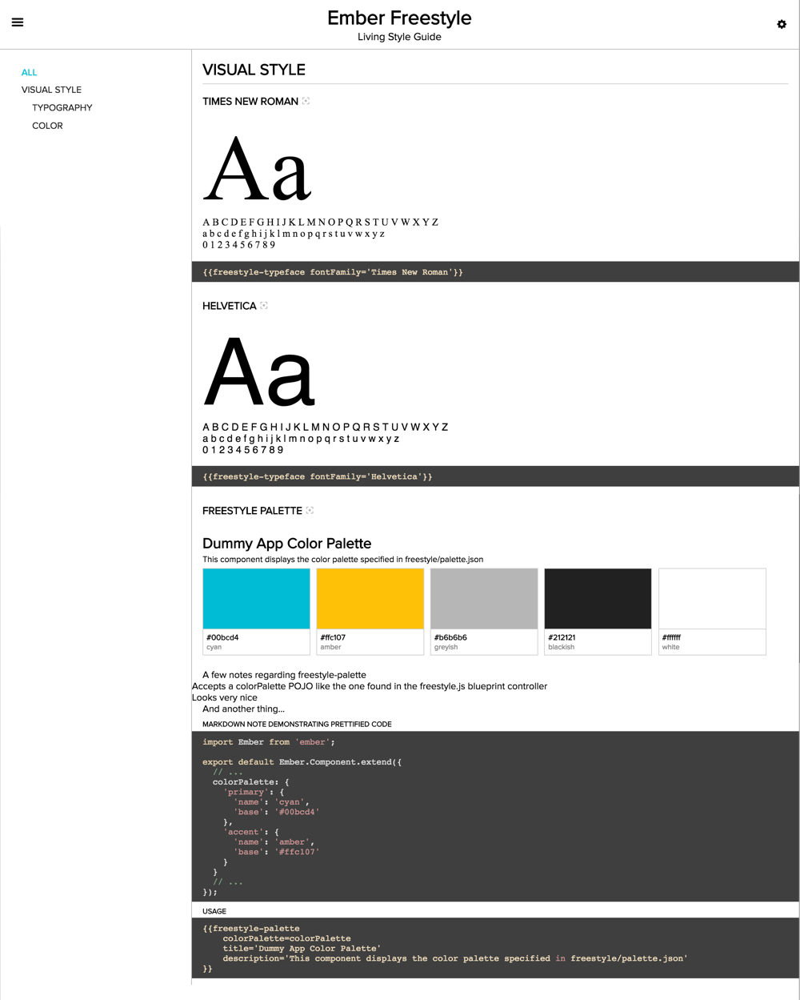

# Ember Freestyle

[](https://travis-ci.org/chrislopresto/ember-freestyle)
[](https://badge.fury.io/js/ember-freestyle)

[](http://emberobserver.com/addons/ember-freestyle)
[](https://conventionalcommits.org)

Ember Freestyle is an Ember addon that allows you to quickly create a component explorer for your Ember app.

## Documentation

This README provides a lightweight overview of Ember Freestyle to get you going. More complete documentation can be found at https://chrislopresto.github.io/ember-freestyle

## Live Demo

To see Ember Freestyle in action, visit [https://chrislopresto.github.io/ember-freestyle/#/acceptance](https://chrislopresto.github.io/ember-freestyle/#/acceptance)

## Compatibility & support

### Compatibility

- For Ember versions >= 2.4, use the latest published version
- For Ember versions 1.13.0 through < 2.4, use ember-freestyle 0.3.0

### Support

Ember Freestyle support is only provided for the 2 latest Ember versions

Installation
------------------------------------------------------------------------------

This installation process is opinionated in order to get you going quickly.

1. `ember install ember-freestyle`

    This will do the following:

    - Install the `ember-freestyle` addon itself
    - Add a `freestyle` template in your app
    - Add a `freestyle` controller in your app

    *Note:* Ember CLI versions < 0.2.3 should use `ember install:addon` instead of `ember install`

1. Add `this.route('freestyle');` to your `router.js` file
1. Navigate to `/freestyle`. You should now see something like:

    

All of the generated output is optional. If you don't want a `freestyle` route, for example, feel free to get rid of it in and add a `freestyle-guide` somewhere else in your app.

You can use the `freestyle-guide` component anywhere you'd like in your app. You can organize your components into multiple Freestyle guides if you want to. You can even use the constituent components like `freestyle-usage` on their own.

## Problems? No problem.

Hopefully the installation instructions got you off to a smooth, seamless start. If you have any problems, feel free to chat with us in the [Ember Community Discord](https://discordapp.com/invite/zT3asNS) or [open an issue](https://github.com/chrislopresto/ember-freestyle/issues/new). As always, PRs are welcome!

## Removing Ember Freestyle from Your Production Payload

We recommend blacklisting Ember Freestyle for production builds using Ember CLI's [addon blacklist feature](https://ember-cli.com/user-guide/#whitelisting-and-blacklisting-assets).

```javascript
var environment = process.env.EMBER_ENV;
var pluginsToBlacklist = environment === 'production' ? ['ember-freestyle'] : [];

module.exports = function(defaults) {
  var app = new EmberApp(defaults, {
    addons: {
      blacklist: pluginsToBlacklist
    }
  };
}
```

## Using Ember Freestyle Within an Addon

### Dependency Configuration

You should include Ember Freestyle as a devDependency so that apps using your addon will not include
Ember Freestyle CSS and JavaScript in their production payloads.

### Code Snippets

You will need to tell the build where to search for code snippets as follows:

##### ember-cli-build.js

```javascript
var app = new EmberAddon(defaults, {
  // ...
  freestyle: {
    snippetSearchPaths: ['addon', 'tests/dummy/app']
  }
});
```
## Running

* `npm run lint:js`
* `npm run lint:js -- --fix`

### Running tests

* `ember test` – Runs the test suite on the current Ember version
* `ember test --server` – Runs the test suite in "watch mode"
* `ember try:each` – Runs the test suite against multiple Ember versions

### Running the dummy application

* `ember serve`
* Visit the dummy application at [http://localhost:4200](http://localhost:4200).

For more information on using ember-cli, visit [https://ember-cli.com/](https://ember-cli.com/).

